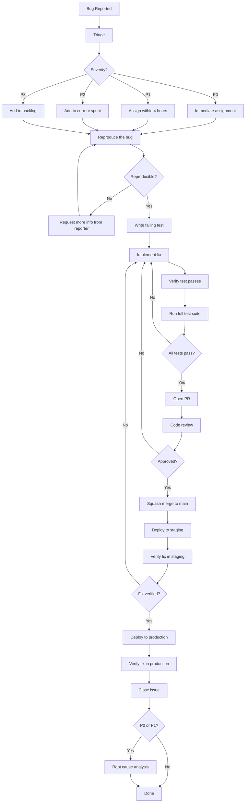

# Bug Fix Process

This document defines how bugs are reported, triaged, fixed, and verified across all Project repositories.

## Severity Levels

| Severity | Description | Response Time | Fix Deadline | Examples |
|---|---|---|---|---|
| **P0** | Production down or data corruption | 1 hour | 4 hours | Service outage, data loss, security breach |
| **P1** | Critical functionality broken | 4 hours | 24 hours | Import declarations failing, QR verification broken |
| **P2** | Important but workaround exists | 24 hours | Next sprint | Incorrect calculation with manual override available |
| **P3** | Minor issue, cosmetic | Next sprint | Backlog | UI alignment, typo, non-critical log noise |

Response time is measured from when the bug is reported to when a developer acknowledges and begins investigation.

## Bug Report Requirements

Every bug report must use the [bug report template](../templates/bug-report.md) and include:

1. **Steps to reproduce** — numbered, specific, deterministic.
2. **Expected behavior** — what should happen.
3. **Actual behavior** — what actually happens.
4. **Environment** — OS, browser, service version, tenant ID.
5. **Logs and screenshots** — relevant error messages, stack traces, UI screenshots.
6. **Affected service/repo** — which Project component is involved.

Incomplete bug reports will be sent back to the reporter for clarification before triage.

## Fix Workflow



## Detailed Process

### 1. Report

Bugs are reported via GitHub Issues using the [bug report template](../templates/bug-report.md). P0 incidents must also be escalated immediately via the team's communication channel (Slack/Zalo group).

### 2. Triage

The on-call engineer or team lead triages incoming bugs within the response time for the assigned severity:

- Validate the report is complete.
- Assign severity level.
- Assign to the appropriate developer or team.
- Label with `bug`, severity (`p0`, `p1`, `p2`, `p3`), and affected repo.

### 3. Reproduce

The assigned developer must reproduce the bug in a local or staging environment before writing any fix:

- Follow the exact steps from the report.
- If the bug is not reproducible, request additional information.
- Document the reproduction environment and any additional findings.

### 4. Write Failing Test (TDD Required)

Before fixing the bug, write a test that demonstrates the failure:

```go
// Go example
func TestImportDeclaration_DuplicateHSCode_ShouldReject(t *testing.T) {
    decl := NewImportDeclaration(WithHSCode("8471.30"))
    err := decl.AddLineItem(WithHSCode("8471.30")) // duplicate
    assert.ErrorIs(t, err, ErrDuplicateHSCode)       // FAILS before fix
}
```

```typescript
// TypeScript example
it('should reject expired QR tokens', async () => {
  const token = createExpiredToken();
  const result = await verifyQR(token);
  expect(result.valid).toBe(false); // FAILS before fix
});
```

Run the test and confirm it **fails for the expected reason**. This proves the test is actually testing the right thing.

### 5. Implement Fix

- Keep the fix minimal and focused. Do not refactor unrelated code in a bug fix PR.
- Follow the [coding standards](coding-standards.md) for the relevant language.
- Add inline comments if the fix is non-obvious.

### 6. Verify

- Run the new test and confirm it passes.
- Run the full test suite to ensure no regressions.
- If the bug affects multiple services, verify cross-service behavior.

### 7. Pull Request

Open a PR following the [PR template](../templates/pr-template.md):

- Reference the bug issue number.
- Explain the root cause in the PR description.
- Include the regression test.
- For P0/P1, use the `hotfix` label for expedited review.

### 8. Deploy and Verify

- Deploy to staging first and verify the fix.
- Then deploy to production.
- Monitor logs and metrics for 30 minutes after production deployment.

## Regression Test Requirement

**Every bug fix must include a regression test.** No exceptions.

The regression test must:
- Reproduce the exact conditions that caused the bug.
- Fail without the fix applied.
- Pass with the fix applied.
- Be a permanent part of the test suite (not a one-off manual check).

PRs that fix bugs without a regression test will be rejected during review.

## Root Cause Analysis

A root cause analysis (RCA) is **required** for all P0 and P1 incidents. Use the [RCA template](../templates/root-cause-analysis.md).

### RCA Process

1. The assigned developer drafts the RCA within 48 hours of resolution.
2. The RCA is reviewed by the team lead.
3. Action items are created as GitHub issues and added to the next sprint.
4. The RCA document is stored in the incident's GitHub issue thread.

### Common Root Cause Categories

| Category | Example | Typical Prevention |
|---|---|---|
| Missing validation | Null HS code accepted | Input validation + test |
| Race condition | Concurrent event writes | Locking or idempotency |
| Configuration drift | Staging vs production env vars | Infrastructure as code |
| Dependency failure | External API timeout not handled | Circuit breaker + retry |
| Data migration issue | Schema change without backfill | Migration testing |

## Rollback Procedure

If a fix causes additional problems after deployment:

1. **Immediately revert** the merge commit on `main`:
   ```bash
   git revert <merge-commit-sha>
   ```
2. Deploy the reverted `main` to production.
3. Investigate why the fix caused problems.
4. Prepare a corrected fix with additional tests covering the new failure mode.
5. Follow the normal PR process for the corrected fix.

Do not attempt to "fix forward" under time pressure for P0 incidents. Revert first, then fix properly.

## Post-Mortem Meeting

A post-mortem meeting is held for every P0 incident:

- **When**: within 3 business days of resolution.
- **Who**: assigned developer, team lead, affected stakeholders.
- **Agenda**:
  1. Review the incident timeline.
  2. Walk through the root cause analysis.
  3. Discuss action items and preventive measures.
  4. Identify process improvements.
- **Output**: finalized RCA document and tracked action items.
- **Culture**: post-mortems are blameless. Focus on systems and processes, not individuals.
