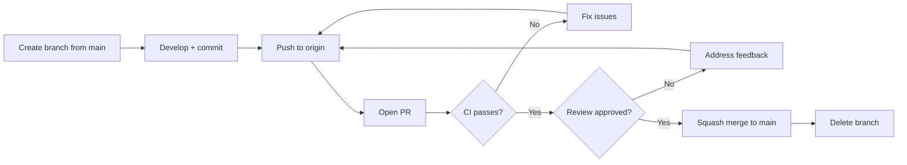

# Git Workflow

This document defines the Git branching strategy, commit conventions, and pull request process for all Project repositories.

## Branch Strategy

Project uses a **trunk-based development** model with a single long-lived branch:

- **`main`** is the only permanent branch. It is always deployable.
- There is **no `develop` branch**. All feature branches are created from `main` and merged back into `main`.
- Short-lived feature branches keep the codebase moving forward without long-running divergence.

## Branch Naming

All branches follow the pattern `<type>/<short-description>`:

| Type | Use Case | Example |
|---|---|---|
| `feat/` | New feature | `feat/IM-01-import-declaration` |
| `fix/` | Bug fix | `fix/QR-verify-cache` |
| `chore/` | Maintenance, deps, CI | `chore/update-deps` |
| `refactor/` | Code restructuring | `refactor/event-chain-storage` |
| `docs/` | Documentation only | `docs/api-versioning-guide` |
| `test/` | Test additions/fixes | `test/co-engine-edge-cases` |

Rules:
- Use lowercase and hyphens (no underscores, no camelCase).
- Include the issue/ticket ID when one exists (e.g., `feat/IM-01-import-declaration`).
- Keep branch names under 50 characters when possible.

## Commit Message Format

[Conventional Commits](https://www.conventionalcommits.org/) are enforced via CI. Every commit message must follow this format:

```
<type>(<scope>): <description>

[optional body]

[optional footer(s)]
```

### Types

`feat`, `fix`, `chore`, `refactor`, `docs`, `test`, `perf`, `ci`, `build`, `style`

### Scopes

Use the service or module name as scope:

```
feat(event-chain): add Business Event validation for import events
fix(qr-verify): handle expired tokens gracefully
chore(deps): bump Go to 1.23
refactor(co-engine): extract rule matching into separate module
docs(api): update External webhook payload examples
test(hs-classifier): add edge cases for ambiguous codes
```

### Rules

- Subject line: imperative mood, lowercase, no period, max 72 characters.
- Body: wrap at 80 characters, explain **why** not **what**.
- Footer: reference issues with `Closes #123` or `Refs #456`.

## Pull Request Flow



### Step-by-Step

1. **Create branch** from latest `main`:
   ```bash
   git checkout main
   git pull origin main
   git checkout -b feat/IM-01-import-declaration
   ```

2. **Develop** with small, focused commits following Conventional Commits.

3. **Push** to origin:
   ```bash
   git push -u origin feat/IM-01-import-declaration
   ```

4. **Open PR** against `main`. Fill in the [PR template](../templates/pr-template.md) completely.

5. **CI runs** automatically: tests, linting, coverage, security scan.

6. **Review**: at least one approval required (see review rules below).

7. **Squash merge** to `main` via GitHub UI. The squash commit message should be a clean Conventional Commit.

8. **Branch deleted** automatically after merge.

## PR Size Limit

Pull requests must not exceed **400 lines of changed code** (additions + deletions), excluding:

- Generated code (protobuf, OpenAPI, migrations)
- Lock files (`package-lock.json`, `Cargo.lock`, `go.sum`)
- Test fixtures and snapshots

If a feature requires more than 400 lines, break it into stacked PRs or incremental deliveries behind a feature flag.

## Review Rules

| Condition | Required Reviewers |
|---|---|
| Default | 1 reviewer minimum |
| Changes to `myproject-crypto` | At least 1 member of `@crypto-core` team |
| Database migration changes | At least 1 member of `@platform` team |
| CI/CD pipeline changes | At least 1 member of `@platform` team |
| Security-sensitive changes | At least 1 member of `@security` team |

### Review Expectations

- Reviewers should respond within **4 business hours**.
- Reviews focus on: correctness, security (tenant isolation, SQL injection), error handling, test quality.
- Use GitHub suggestions for small fixes. Do not nit-pick style issues that linters already cover.
- Approve only when you are confident the code is production-ready.

## Merge Strategy

- **Squash merge** is the only allowed merge method on `main`.
- This produces a clean, linear commit history.
- The squash commit message must be a valid Conventional Commit.
- The PR title is used as the default squash commit message — write good PR titles.

## Rebase Before Merge

Before a PR can be merged, it must be up to date with `main`:

```bash
git fetch origin main
git rebase origin/main
git push --force-with-lease
```

Use `--force-with-lease` (never `--force`) when pushing a rebased branch. This prevents accidentally overwriting someone else's work.

## Hotfix Process

For P0 production incidents:

1. Branch from `main`: `fix/hotfix-description`
2. Implement the minimal fix with a regression test.
3. Open a PR with the `hotfix` label.
4. **Expedited review**: 1 hour SLA for P0 incidents. Ping the on-call reviewer directly.
5. Squash merge to `main`.
6. Deploy immediately.
7. Follow up with a [root cause analysis](../templates/root-cause-analysis.md).

## Prohibited Actions

- **No force push to `main`** — ever, under any circumstances. Branch protection rules enforce this.
- **No direct commits to `main`** — all changes go through PRs.
- **No merge commits** — squash merge only.
- **No long-lived feature branches** — branches older than 5 days should be reviewed for splitting or abandonment.

## Repository-Specific Notes

| Repository | Additional Rules |
|---|---|
| `myproject-infra` | DB migration PRs must include rollback scripts |
| `myproject-core` | Service boundary changes need architecture review |
| `myproject-crypto` | All PRs require `@crypto-core` review |
| `myproject-frontend` | Include screenshots for UI changes |
| `myproject-compliance` | Regulatory rule changes need compliance team sign-off |
